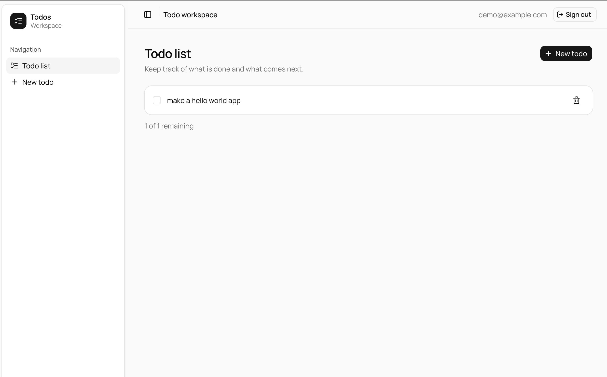

# Elysia + TanStack Dashboard Monorepo

An opinionated, end-to-end type-safe monorepo for authenticated web products:
an Elysia API, TanStack Start frontend, Postgres, and a small todo vertical
slice that demonstrates the architecture without hiding it behind abstractions.

[](https://app.rock8.cloud/login?redirect=%2Fnew-deployment%3Fblueprint%3Delysia-tanstack-dashboard-monorepo%26utm_source%3Dgithub%26utm_medium%3Dreadme%26utm_campaign%3Dblueprint)



> **Optional seeded login:** `demo@example.com` / `demo12345`  
> Created only when the `SEED_*` values from `apps/server/.env.example` are set.

> **Starter scope:** this is a strong baseline for SaaS, dashboards, internal
> tools, and CRUD-heavy web products. It is intentionally not a universal
> starter for static sites, mobile apps.

| Layer    | Tech                                                                                                                                        |
| -------- | ------------------------------------------------------------------------------------------------------------------------------------------- |
| Monorepo | [Turborepo](https://turborepo.dev) + [Bun](https://bun.sh) workspaces                                                                       |
| API      | [Elysia](https://elysiajs.com) (Bun) + [Eden](https://elysiajs.com/eden/overview) for end-to-end types                                      |
| Auth     | [better-auth](https://better-auth.com) (email + password, OIDC-ready)                                                                       |
| Database | Postgres + [Drizzle ORM](https://orm.drizzle.team) + [Postgres.js](https://github.com/porsager/postgres)                                    |
| Web      | [TanStack Start](https://tanstack.com/start) + [TanStack Query](https://tanstack.com/query) + [shadcn/ui](https://ui.shadcn.com) on Base UI |
| Tooling  | [oxlint](https://oxc.rs) + [oxfmt](https://oxc.rs) + TypeScript                                                                             |

## Getting started

Prerequisites: [Bun](https://bun.sh) ≥ 1.3.14 and Docker.

```sh
bun install

# environment files
cp apps/server/.env.example apps/server/.env   # then set BETTER_AUTH_SECRET (openssl rand -base64 32)
cp apps/web/.env.example apps/web/.env

bun run db:up        # start Postgres (docker compose, host port 5434)
bun run dev          # web on :3000, api on :3001
```

The API applies pending migrations before it starts listening and creates a seed
user only when explicitly enabled through environment variables. The checked-in
lockfile makes installs reproducible. Keep secrets in local `.env` files; only
commit `.env.example` files.

### Seeded login (optional)

Open [http://localhost:3000/login](http://localhost:3000/login) and sign in with:

| Field    | Default            |
| -------- | ------------------ |
| Email    | `demo@example.com` |
| Password | `demo12345`        |

These values come from `apps/server/.env`; no user credentials are hardcoded in
the application. Set `SEED_DEFAULT_USER=true` together with `SEED_USER_NAME`,
`SEED_USER_EMAIL`, and `SEED_USER_PASSWORD` to create the account. Omit them or
set `SEED_DEFAULT_USER=false` to disable seeding.

## Use it as a starter

1. Create a repository from this template or copy it without its Git history.
2. Replace the app title, favicon, and example todo domain for your product.
3. Review every value in both `.env.example` files.
4. Keep the route → service → query boundaries when adding backend features.
5. Run `bun run validate` before the first commit and in your delivery pipeline.

## Structure

```
apps/
  server/            Elysia API
    src/
      routes/        HTTP layer: validation (typebox) + auth guard, calls services
      services/      Business logic, calls db/queries
      db/
        client.ts    Drizzle client — may only be imported inside src/db
        schema/      Drizzle tables (auth.ts is generated by better-auth)
        queries/     ALL database queries live here
      plugins/       Elysia plugins (auth macro + better-auth handler)
      lib/           better-auth instance
    drizzle/         Generated SQL migrations
  web/               TanStack Start app
    src/
      routes/        File-based routes (_authed/ subtree requires a session)
      lib/           Eden client, auth client, query options/mutations
      components/    shadcn/ui components
packages/
  typescript-config/ Shared tsconfig
```

## Architecture rules

- **Database access only in `src/db`.** Routes and services never import the
  Drizzle client or `drizzle-orm` — enforced by an oxlint
  `no-restricted-imports` rule (`apps/server/.oxlintrc.json`). Need a new
  query? Add a function to `src/db/queries/`.
- **Layering:** `routes` (validate + authorize) → `services` (business logic)
  → `db/queries` (SQL). Queries are scoped by `userId` so ownership is
  enforced at the data layer.
- **End-to-end types:** the web app imports only the _type_ of the Elysia app
  (`import type { App } from "@repo/server"`), and Eden derives a fully typed
  client from it. No codegen, no shared DTO package.
- **Auth:** better-auth issues cookie sessions. Protected routes declare
  `{ auth: true }` (an Elysia macro that resolves the session or returns 401).
  On the web, the `_authed` route subtree redirects to `/login` without a
  session; the session is read via a Start server function so SSR forwards
  the browser's cookies.

## Common workflows

| Task                      | How                                                                                                                 |
| ------------------------- | ------------------------------------------------------------------------------------------------------------------- |
| Change the db schema      | Edit `src/db/schema/*`, then `bun run db:generate`; the API applies it on its next start                            |
| Add an OIDC provider      | Add `socialProviders` in `apps/server/src/lib/auth.ts`; re-run `auth:generate` + db migration if the schema changed |
| Regenerate auth tables    | `bun run auth:generate` (in `apps/server`)                                                                          |
| Inspect the db            | `bun run db:studio`                                                                                                 |
| Lint / typecheck / build  | `bun run lint` / `bun run check-types` / `bun run build`                                                            |
| Run tests                 | `bun run test`                                                                                                      |
| Run the full quality gate | `bun run validate`                                                                                                  |
| Audit high-risk packages  | `bun run security:audit`                                                                                            |

## Quality baseline

`bun run validate` provides a platform-independent gate for formatting,
linting, strict type checks, unit tests, and production builds. This repository
intentionally contains no GitHub Actions or GitHub CI/CD configuration.
Rock8Cloud builds and deploys both applications from their checked-in
Dockerfiles.

## Deploy on Rock8Cloud

### Deploy through MCP

This repository includes [`.mcp.json`](.mcp.json) with the Rock8Cloud MCP
endpoint already configured. Open the project in an MCP-compatible coding
agent, log in to Rock8Cloud when the OAuth prompt opens, and ask:

```text
Deploy this project to Rock8Cloud.
```

No API key, deployment CLI, or GitHub Actions workflow is required. The agent
can provision Postgres, create both services, configure their environment, and
start the deployment through the authenticated MCP connection.

### One-click deployment

[Deploy the blueprint](https://app.rock8.cloud/login?redirect=%2Fnew-deployment%3Fblueprint%3Delysia-tanstack-dashboard-monorepo%26utm_source%3Dgithub%26utm_medium%3Dreadme%26utm_campaign%3Dblueprint) to provision Postgres and deploy both services:

- `apps/server/Dockerfile` builds the Elysia API on port `3001`. On startup it
  applies pending migrations and idempotently creates the configured seed user.
- `apps/web/Dockerfile` builds the TanStack Start app on port `3000` and accepts
  `VITE_SERVER_URL` as a build argument.
- Rock8Cloud supplies `DATABASE_URL`, generates `BETTER_AUTH_SECRET`, and wires
  the public API and web URLs through the remaining environment variables.

Register the Rock8Cloud blueprint with the slug
`elysia-tanstack-dashboard-monorepo` and the repository root as the build
context for both application services:

| Service  | Dockerfile               | Port | Required configuration                                                                                          |
| -------- | ------------------------ | ---- | --------------------------------------------------------------------------------------------------------------- |
| Postgres | Managed PostgreSQL       | 5432 | Link its `URL` output to the API as `DATABASE_URL`                                                              |
| API      | `apps/server/Dockerfile` | 3001 | `BETTER_AUTH_SECRET`, `BETTER_AUTH_URL` (API URL), `CORS_ORIGIN` (web URL), and optional `SEED_*` values        |
| Web      | `apps/web/Dockerfile`    | 3000 | Pass the API public URL to the Docker build as `VITE_SERVER_URL`; the Dockerfile declares the matching argument |

The API health-check path is `/health`. The web login page remains available
while the API is starting, so the two services can roll out independently.

## Ports

| Service  | URL                   |
| -------- | --------------------- |
| Web      | http://localhost:3000 |
| API      | http://localhost:3001 |
| Postgres | localhost:5434 (host) |

## Contributing and license

See [CONTRIBUTING.md](CONTRIBUTING.md) and [SECURITY.md](SECURITY.md). Licensed
under the [MIT License](LICENSE).
